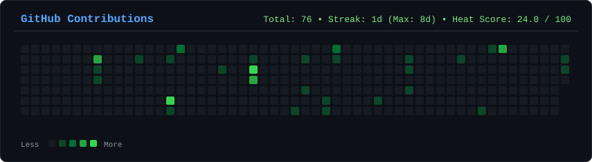
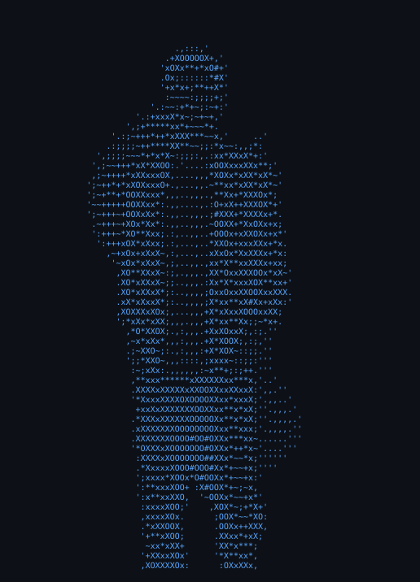

<div align="center">

```
╭────────────────────────────────────────────────────╮
│                                                    │
│   Welcome to Sarthak's Living Terminal             │
│                                                    │
│   AI Engineer | Backend Developer                  │
│   Building AI Systems, Agents & Products           │
│                                                    │
╰────────────────────────────────────────────────────╯
```

<a href="https://github.com/Sarthak-Pandey"></a>

</div>

<div align="center">

### `$ cat contributions.log`



</div>

<br>

<div align="center">

### `$ living-terminal --whoami`

<table>
<tr>
<td valign="top">

</td>
<td valign="top">

</td>
</tr>
</table>

</div>

---

## 📊 GitHub Analytics & Telemetry

<div align="center">

| Metric | Value | Metric | Value |
| :--- | :---: | :--- | :---: |
| 📦 **Public Repos** | `18` | 🔥 **Total Contributions** | `76` |
| 👥 **Followers** | `0` | ⚡ **Current Streak** | `1 days` |
| 👤 **Following** | `0` | 🏆 **Longest Streak** | `8 days` |
| 📈 **Avg Commits** | `2.62/day` | 📅 **Most Active** | `2026-07-14` |
| 🌡️ **Heat Score** | `24.0 / 100` | 🚀 **Status** | `Active & Building` |

</div>

---

## 🛠️ Technical Arsenal

**💻 Languages**

<p>   </p>

**🎨 Frontend**

<p>   </p>

**⚙️ Backend**

<p>   </p>

**🗄️ Databases**

<p>  </p>

**🤖 AI Engineering**

<p>       </p>

**🧠 Machine Learning**

<p>   </p>

**☁️ DevOps & Cloud**

<p>    </p>

---

## 📚 Currently Learning

- [x] LangGraph
- [x] MCP
- [x] RAG
- [x] AI Agents
- [x] Prompt Optimization
- [x] WorldQuant Brain
- [x] Backend Engineering
- [x] System Design
- [x] AWS
- [x] MLOps

---

## 🚀 Current Projects

| Project | Status |
| :--- | :---: |
| **Living Terminal** | 🔨 In Progress |
| **AI Core Search** | 🔨 In Progress |
| **Prompt Optimizer** | 🔨 In Progress |
| **Moodify** | 🔨 In Progress |

---

## 🔬 Research Interests

- 🔹 Large Language Models
- 🔹 AI Agents
- 🔹 Retrieval-Augmented Generation
- 🔹 Prompt Engineering
- 🔹 Prompt Optimization
- 🔹 WorldQuant Alpha Research
- 🔹 Backend Architecture
- 🔹 System Design

---

<div align="center">

<sub>🕐 Last updated: 2026-07-29 09:58 UTC · Generated automatically by <b>Living Terminal</b></sub>

</div>
